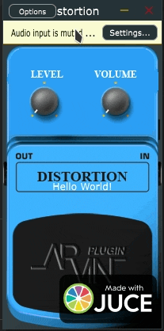

# ArvinDistortion

# Distortion Plugin - "Hello World!"

Sebuah plugin audio berbasis **JUCE** yang dirancang dengan antarmuka klasik pedal efek. Proyek ini merupakan tahap awal pengembangan efek distorsi digital yang berfokus pada kemudahan penggunaan dan kontrol esensial.

## 🚀 Status Pengembangan
Plugin ini saat ini dalam status **Work in Progress (Pengembangan Aktif)**. 
* **Fitur Saat Ini:** Kontrol Level dan Volume dasar dengan algoritma distorsi inti.
* **Target Berikutnya:** Implementasi **EQ Band** (Low, Mid, High) untuk membentuk karakter suara yang lebih spesifik dan memangkas frekuensi yang tidak diinginkan setelah tahap distorsi.

## 🛠 Fitur Utama
* **Level Control:** Menentukan intensitas saturasi atau distorsi yang diterapkan pada sinyal input.
* **Volume Control:** Mengatur output akhir (make-up gain) untuk memastikan level sinyal tetap konsisten.
* **Custom GUI:** Desain antarmuka visual yang terinspirasi dari pedal stompbox ikonik berwarna biru.

## 💻 Teknologi yang Digunakan
* **Framework:** [JUCE](https://juce.com/) (C++) versi kompatible adalah JUCE version 7.0.9
* **Format:**Standalone Binary / VST3 / AU / LV2 (Kompatibel dengan sebagian besar DAW seperti FL Studio, Ableton Live, atau Logic Pro).

## 👷‍♂️ Pengembang
Dibuat dengan penuh dedikasi oleh **Fajar Julyana**.

---

### Cara Menggunakan (Untuk Pengembangan)
1. Clone repositori ini.
2. Buka berkas `.jucer` menggunakan **Projucer**.
3. Pilih eksportir yang sesuai dengan IDE kamu (Visual Studio on Windows, Xcode on MacOS dan CMake on Linux).
4. Build proyek untuk menghasilkan file plugin.

---

### Catatan Tambahan
> *"Aplikasi ini masih dalam tahap pengembangan awal. Penambahan EQ band sangat krusial untuk memberikan kontrol tonal yang lebih baik bagi pengguna."*